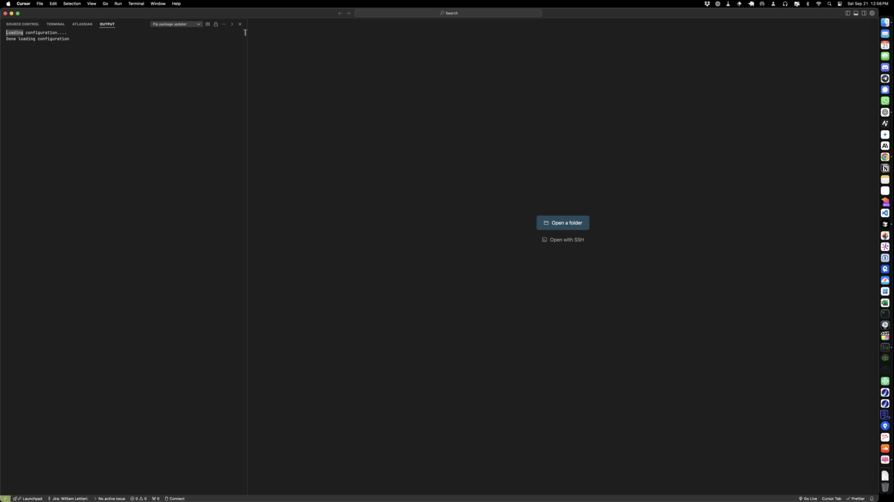

# Install LibreChat

## Installing LibreChat

The first step is to install LibreChat either locally or on a server. The [documentation](https://www.librechat.ai/docs) is quite extensive and should complete walk through the setup process.&#x20;

This document will walk through the setting up of LibreChat in a broader sense, but refer to the [LibreChat Documentation](https://www.librechat.ai/docs) for further detail.

**NOTE**: This API adapter documentation assumes that LibreChat is  run via Docker. While it is certainly possible to run the adapter outside of Docker as a standalone Express Node.js application, this documentation will not go into detail for that setup. It is **strongly** recommended for a variety of reasons to use the Docker method of running the software.

***

### Local Installation

Installing LIbreChat locally is a great option to test it out. If you require access from other locations or want to offer users a way to use your chat, check out the [remote installation options](install-librechat.md#remote-installation).

[Local Installation >](https://www.librechat.ai/docs/quick\_start/local\_setup)

***

### Remote Installation <a href="#remote-installation" id="remote-installation"></a>

[Remote Installation >](https://www.librechat.ai/docs/remote)

For remote installation on a server, we recommend Digital Ocean due to its reputation and intuitive interface.  Detailed installation instructions can be found below.

[Digital Ocean LibreChat Installation >](https://www.librechat.ai/docs/remote/digitalocean)

Ensure you set up a non-root user for your Droplet and set up an SSH Key. You can do this by accessing your Droplet in the Digital Ocean console, and then:

1.  **Create a New User:**

    * Use the following command to create a new user. Replace `your_username` with your preferred username.


    ```bash
    adduser your_username
    ```


2. You’ll be prompted to create a password for the new user and optionally fill out additional information (which you can skip by pressing Enter).\

3.  **Add the New User to the Sudo Group:**\


    * To allow the new user to execute administrative commands (like `apt update` or managing services), you need to add them to the sudo group.\


    ```bash
    usermod -aG sudo your_username
    ```

    \
    This gives the user root-like privileges via `sudo`, which is safer than logging in as root directly.\

4.  **Set Up SSH Access for the New User (Optional but Recommended):**\


    * To secure access, you can set up SSH key authentication for the new user. First, switch to the new user:\


    ```bash
    su - your_username
    ```


    * Then, create an `.ssh` directory and set the correct permissions:

    ```bash
    codemkdir ~/.ssh
    chmod 700 ~/.ssh
    ```


    * Copy your SSH public key to set up in the creation of the Droplet to the new user’s `.ssh` directory:
    *

    ```bash
    nano ~/.ssh/authorized_keys
    ```


    * Paste your SSH public key into this file, save, and close the editor. Then set the correct permissions:\


    ```bash
    chmod 600 ~/.ssh/authorized_keys
    ```


Additionally, set up your firewall following the instructions in Step 4.

Once you have set up your Droplet in Digital Ocean, we recommend using an IDE like [Visual Studio Code](https://code.visualstudio.com/) or our personal favorite due to its AI capabilities, [Cursor](https://www.cursor.com/). The instructions below will walk through the setup using Cursor.

Click `Open with SSH` in a new window of Cursor.

<figure><figcaption></figcaption></figure>

Select Add New SSH Host and enter \<username>@\<ip address> and choose the SSH configuration you set up for the Droplet. Click `Connect` in the popup or in the future, you will now see your new SSH config when you click on `Open with SSH.`

Now you should have a terminal that is in your Droplet. At this point you can continue the process by cloning LibreChat and the adapter and modifying the configuration files.

***

### Configuring LibreChat

The adapter will utilize three main configuration components in LibreChat:

1. Docker override file \[ docker-compose.override.ym l]  [More Information >](https://www.librechat.ai/docs/configuration/docker\_override)
2. environment variables file \[ .env ]   [More Information >](https://www.librechat.ai/docs/configuration/dotenv)
3. LibreChat YAML configuration file \[ librechat.yaml ]  [More Information >](https://www.librechat.ai/docs/configuration/librechat\_yaml)

***

### Next Steps

Once you have a LibreChat instance up and running, you can move on to the next step in the process: creating a Coze AI Chatbot. If you have one already and a Coze API key that works with it, you can skip ahead to the [adapter installation](install-api-adapter.md).
